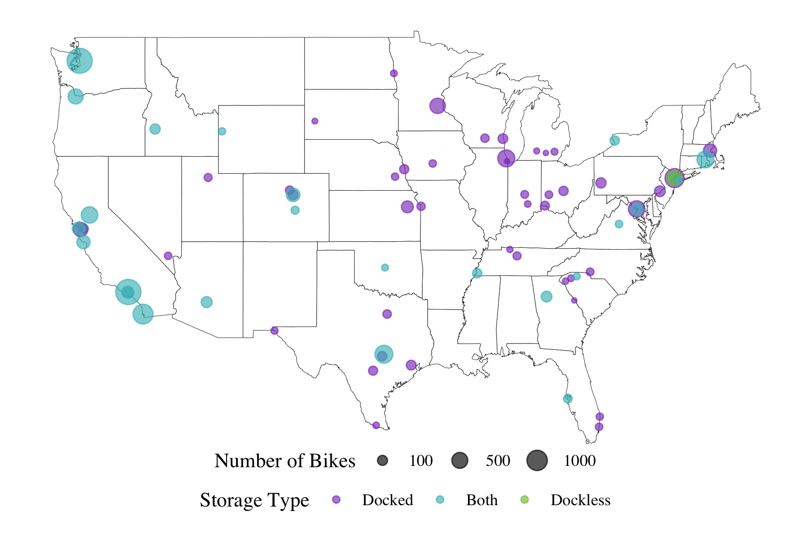

## Encouraging Equitable Bikeshare: Implications of Docked and Dockless Models for Spatial Equity

##### *Simon Couch, Heather Kitada Smalley*

The last decade has seen a rapid rise in the number of bikeshare
programs, where bikes are made available throughout a community on an
as-needed basis. Given that many of these programs are at least
partially publicly funded, a central concern of operators and investors
is whether these systems operate equitably. Though spatial equity has
been well-studied under the docked model, where bikes are picked up and
dropped off at prespecified docking stations, there has been little work
examining that of the increasingly popular dockless model, where bikes
can be picked up and dropped off from anywhere within an operating area.
We explore comparative equity in spatial access to bikeshare services
under these two models by collecting spatial data on 45,935 bikes from
73 bikeshare systems using a novel querying approach (with generalizable
and freely available source code), and joining this data with
newly-available sociodemographic data at the census tract level. Using
Poisson count regression, we perform the first comparative analysis of
the two docking approaches, finding that dockless systems operate more
equitably than docked systems by education, but do not differ in spatial
access by socioeconomic class.

This repository contains source code and data for the project. See
`/code` for source data, `/data` for raw data, and `paper.pdf` for a
paper summarizing our findings, also available on arXiv.
